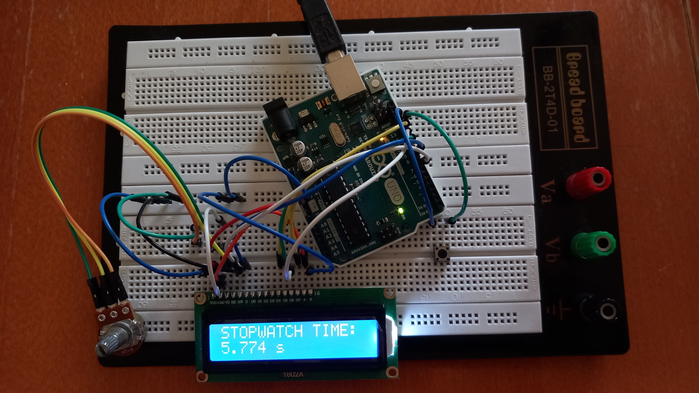

# stopwatch
This is stopwatch using internal Arduino clock, displaying time on LCD screen. 
The program uses the millis() function to measure time in milliseconds in the background. This approach does not interfere with the rest of the program or slow down its execution.
This stopwatch displaying time in seconds and milliseconds.

